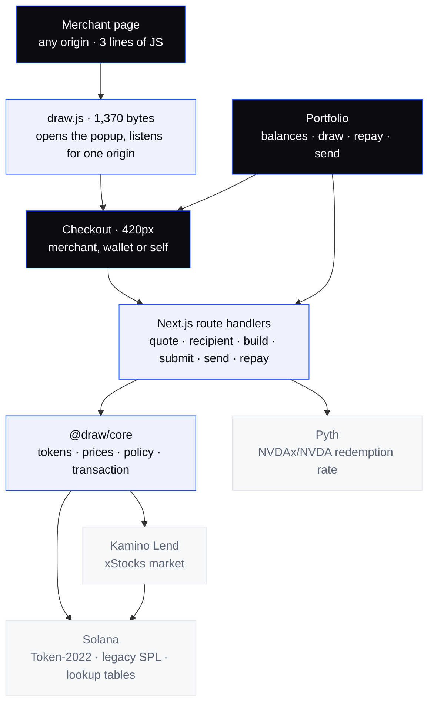

<a id="top"></a>

<h1 align="center">Draw</h1>

<p align="center">
  <strong>Pay without selling your shares.</strong><br>
  Turn stock into spendable dollars on Solana. One transaction, no credit check.
</p>

<p align="center">
  <a href="https://draw-fin.vercel.app"><strong>See it ↗</strong></a>
  &nbsp; · &nbsp;
  <a href="#x-running-it">Run it locally</a>
  &nbsp; · &nbsp;
  <a href="#xi-what-is-true-and-what-is-not">What works today</a>
  &nbsp; · &nbsp;
  <a href="https://hackathons.solana.com/hackathons/stocklana">Stocklana ↗</a>
</p>

<p align="center">
  <sub>The live site is the landing page. The app itself runs against a local
  mainnet fork — <a href="#x-running-it">see Run locally</a>.</sub>
</p>

<p align="center">
  <sub>SOLANA &nbsp; / &nbsp; KAMINO LEND &nbsp; / &nbsp; TOKEN-2022 xSTOCKS &nbsp; / &nbsp; NEXT.JS 16</sub>
</p>

---

A draw is **one transaction**: deposit the collateral, refresh the obligation,
borrow the stablecoin, and send it where it is going. Paying a merchant takes
17 instructions and **1,036 of the 1,232 bytes** a Solana transaction is allowed.

Before the lookup table it was 1,512 bytes, and none of this existed.

| Where the money goes | Instructions | Size | Compute units |
| :--- | :---: | :---: | :---: |
| A merchant, from their checkout | 17 | 1,036 / 1,232 | 317,774 |
| Your own wallet | 15 | 946 / 1,232 | 302,687 |
| Another Solana wallet | 13 | 829 / 1,232 | 290,331 |

<p align="center"><sub>Recorded September 2026 · forked Solana mainnet via Surfpool · Kamino xStocks market.<br>Two signatures on every one — the user and Draw's fee payer. Every signature is in <a href="#xi-what-is-true-and-what-is-not">What works today</a>.</sub></p>

> **The collateral is the underwriting.**
>
> Most of the world has no credit bureau, so it has no consumer credit. The
> bottleneck was never interest rates — it was the absence of underwriting data.
> A liquid, 24/7-liquidatable, on-chain asset replaces the bureau entirely.

| What has been observed on chain | Where the boundary is |
| :--- | :--- |
| Deposit, borrow and payment landing atomically | Every measurement is against a mainnet **fork**, not mainnet. |
| A cross-origin merchant checkout paying a real merchant wallet | The merchant registry is one environment-configured store. |
| Drawing to your own wallet, and sending it on to a stranger | Solana addresses only. No fiat offramp exists. |
| Repayment releasing the collateral, $40.00 → $0.00 | Partial repayment is built but unexercised. |
| A first-time user with zero SOL completing a payment | Draw sponsors the rent; that subsidy has no accounting behind it. |
| The shop confirming an order from a signed webhook, not the browser | Retries are in-process and last about two seconds. |

**Everything here runs against a mainnet fork, not mainnet.** That and every
other boundary are stated plainly in [What works today](#xi-what-is-true-and-what-is-not).

<details>
<summary><strong>Contents — the product, the engineering, the evidence</strong></summary>

| | Chapter | |
| :--- | :--- | :--- |
| 01 | [The gap](#i-the-problem) | Why you sell something you wanted to keep |
| 02 | [The promise](#ii-the-one-idea) | One confirmation, one transaction |
| 03 | [Architecture](#iii-the-shape) | Two origins, one chain layer |
| 04 | [The life of a draw](#iv-the-life-of-a-draw) | Quote, build, sign, submit |
| 05 | [Three destinations](#v-three-destinations) | A merchant, a wallet, or yourself |
| 06 | [Getting out](#vi-getting-out) | Repayment, and the balance sheet |
| 07 | [Risk](#vii-risk) | Draw's own limits, and why they are lower |
| 08 | [Engineering decisions](#viii-the-decisions) | Thirteen choices and the incidents behind them |
| 09 | [Repository map](#ix-the-map) | Where the moving parts live |
| 10 | [Run locally](#x-running-it) | Fork, fund, run |
| 11 | [What works today](#xi-what-is-true-and-what-is-not) | Observed, unobserved, absent |

</details>

---

<a id="i-the-problem"></a>

## 01 · The gap

You own $200 of Nvidia. You need $40 today.

Selling is the obvious move and it is the expensive one: a settlement delay, a
taxable event, and the permanent surrender of the upside on something you bought
because you believed in it. The alternative is not buying the thing.

The instrument that solves this already exists. It is called securities-backed
lending, and it is how wealthy people fund their lives without liquidating
anything. It requires a private bank, a six-figure minimum, days of paperwork,
and market hours.

**The asset became programmable before the credit product did.** xStocks are
Token-2022 mints that anyone can hold without being whitelisted, and Kamino will
already lend against them. Nothing between those two facts and a checkout button
existed, which is the entire reason this repository does.

They are not bearer assets, and this README is not going to pretend otherwise —
see [the issuer keeps the keys](#the-issuer-keeps-the-keys) for what the mint
authority can still do to collateral Draw is holding.

---

<a id="ii-the-one-idea"></a>

## 02 · The promise

> **One confirmation. One transaction. You keep the shares.**

A merchant site has a *Pay with Draw* button. The user clicks it, sees
*"borrowing $40 against your NVDAx — you keep all 1.42 shares"*, and confirms.

Behind that single confirmation, one Solana transaction deposits the collateral,
borrows the stablecoin, and pays the merchant. Everything else in this repository
is downstream of that sentence:

- **Atomic or nothing.** There is no window where a user has taken on debt and
  the merchant has not been paid. That is not a retry policy, it is the
  transaction boundary.
- **The merchant never learns what the funding source was.** The SDK's surface
  mentions no wallet, no collateral, no liquidation. If integrating required
  understanding any of it, the argument for Draw collapses.
- **Nothing the client sends is trusted with money.** The quote is always
  recomputed server-side, and a merchant's payee always comes from the origin
  rather than the request — [decision 6](#6-the-client-never-names-the-payee-and-never-names-the-price).
  A destination the user typed themselves is the one exception, and
  [decision 11](#11-the-destination-has-two-trust-models) is why that is not the
  same thing.

---

<a id="iii-the-shape"></a>

## 03 · Architecture

Two origins, because a payment surface that trusts its host page is not a payment
surface. One chain layer, because every byte that reaches Solana should be built
by the same code.

| Surface | Location | Stack | Role |
| :--- | :--- | :--- | :--- |
| **App** | [`apps/web/`](apps/web/) | Next.js 16 · Tailwind 4 | Landing, portfolio, checkout popup, send, API routes |
| **Demo merchant** | [`apps/store/`](apps/store/) | Next.js 16 | A different origin, on purpose |
| **Chain layer** | [`packages/core/`](packages/core/) | `@solana/kit` · klend-sdk v12 | Tokens, pricing, Kamino, Pyth, policy, transactions |
| **Integration** | [`packages/sdk/`](packages/sdk/) · [`embed/`](packages/embed/) | zero-dependency TS | Webhook verification, a 1,370-byte shim |



**On-chain is value and ownership; off-chain is coordination.** Balances, debt,
collateral and the payment itself live on Solana. There is no payments table
anywhere: the transaction signature *is* the receipt, and a second record of it
could only ever disagree with the first.

There is also no database. An earlier version of this carried a Convex
deployment for merchants and checkout sessions; it was written, never deployed,
and never called by the checkout, which reads its amount and origin from the
popup URL. It has been removed rather than left in the repository looking load
bearing.

What replaced it is smaller and honest about its size: **one merchant, declared
in the environment, resolved from the origin on every request.** A real
deployment needs a table and a merchant dashboard. It does not need a database
in the payment path.

> [!IMPORTANT]
> Draw reads Pyth for one thing and it is not the price. Kamino's oracle prices
> the collateral; Pyth answers whether that collateral is still tracking the
> share behind it. See [Risk](#vii-risk).

---

<a id="iv-the-life-of-a-draw"></a>

## 04 · The life of a draw

Four server round trips, one browser signature, one transaction.

| Stage | Where | What it establishes |
| :--- | :--- | :--- |
| **01 · Open** | `draw.js` in the merchant page | A 420px popup on Draw's origin, not an iframe in theirs |
| **02 · Quote** | `POST /api/quote` | Collateral required, health factor, liquidation price, 30s TTL |
| **03 · Build** | `POST /api/tx/build` | The unsigned transaction, fee payer declared, quote recomputed |
| **04 · Sign** | The browser | Privy embedded wallet. Draw holds no user key material |
| **05 · Submit** | `POST /api/tx/submit` | Fee payer co-signs, **simulates**, then sends |

<details>
<summary><strong>1 · Pricing — the reserve's own oracle, never a second feed</strong></summary>

`packages/core/src/prices.ts` reads collateral value from the Kamino reserve
Draw will actually borrow against. Not Pyth directly, not a price API.

Pricing collateral from one source while the protocol liquidates against another
tells users they are safe right up until they are not. The two numbers agree
because they are the same number.

The liquidation threshold is read from `reserve.state.config` on every quote for
the same reason — it differs per asset and changes when Kamino reconfigures a
market, and a hardcoded copy would put Draw's health factor quietly out of step
with the protocol's.

</details>

<details>
<summary><strong>2 · The transaction — what actually goes in it</strong></summary>

```text
   ┌─ setup ──────────────── first draw only, rides along in the same tx
   │  initUserMetadata · InitObligation · createUserLut
   │  ATA creation for collateral and debt
   │  ~0.05 SOL from the fee payer, because Kamino bills the USER for this
   │
   ├─ lending ─────────────── every draw
   │  RefreshReserve · RefreshObligation
   │  Deposit          ← collateral in
   │  inBetweenIxs     ← the refresh that makes the deposit visible
   │  Borrow           ← stablecoin out
   │
   └─ payment ────────────── the part the merchant cares about
      Transfer  user → merchant
```

The ordering of `inBetweenIxs` is not cosmetic. Kamino returns it as a separate
array precisely because it belongs *between* the deposit and the borrow; placed
before both, the obligation refresh sees an empty obligation and the whole thing
fails with `InvalidAccountInput`, an error that names nothing relevant.
`interleaveLendingIxs` in [`kamino.ts`](packages/core/src/kamino.ts) exists
entirely for that.

Deposit-and-borrow is built as one `KaminoAction` rather than a deposit followed
by a borrow, which matters: both legs land on the same obligation by
construction, so there is no way to deposit into one position and borrow against
another.

</details>

<details>
<summary><strong>3 · Fitting inside 1,232 bytes</strong></summary>

The assembled draw was **1,512 bytes**. The limit is 1,232. There is no version
of this product that does not solve that.

The fix is a Draw-owned address lookup table holding **22 accounts** — the
intersection of the accounts two different users' draws touch, so it compresses
any user's transaction rather than one user's. Kamino also mints a per-user
table during setup, and `getUserLookupTable` reads it back out of the user's
`UserMetadata` PDA.

```text
   1,512 bytes   no lookup table          over the limit, nothing can pay
   1,036 bytes   shared LUT, 22 accounts  196 bytes of headroom
```

`serverEnv.lookupTables` reads the table address **from disk on every request**
rather than from the environment. A fork reset mints a new table, environment
variables are fixed when the server boots, and needing a restart after every
reset is exactly the kind of thing that fails during a demo.

</details>

<details>
<summary><strong>4 · Simulate, then send</strong></summary>

`/api/tx/submit` co-signs, simulates with `sigVerify: false`, and only sends on a
clean simulation. A transaction that is going to fail should fail where there is
still a person to explain it to, rather than on chain where the user has
committed and gets back a signature that went nowhere.

The failure copy says *"That payment can't go through right now. Nothing was
charged."* The second sentence is the one that matters and it is true by
construction — an unsent transaction moved nothing.

</details>

---

<a id="v-three-destinations"></a>

## 05 · Three destinations

Draw does one thing. Sometimes the money goes to a merchant, sometimes to
somebody else, sometimes it stays with you.

> **Turn stock into spendable dollars without selling it.**
> Where those dollars land is a parameter, not a second product.

| Destination | How it is named | Instructions |
| :--- | :--- | :---: |
| A merchant | Resolved server-side from the checkout's origin | 17 |
| Your own wallet | Nobody names it. It is the signer | 15 |
| Another Solana wallet | Typed by the user, checked against the chain | 13 |

**Solana addresses only.** There is no fiat offramp and this README will not
imply one. Getting dollars out to a bank is somebody else's licence.

<a id="the-issuer-keeps-the-keys"></a>

### The issuer keeps the keys

An earlier version of this README called xStocks "permissionless, no freeze
authority, no whitelist." One of those three is true. Read off the NVDAx mint
(`Xsc9qvGR…x9qEh`) on a mainnet fork:

| Extension | Value | What it means |
| :--- | :--- | :--- |
| `defaultAccountState` | `initialized` | **No whitelist.** Anyone can receive and hold one. |
| `freezeAuthority` | `JDq14BWv…xJNs` | The issuer can freeze any account holding one. |
| `permanentDelegate` | `5aMNNLQJ…HFvEq` | The issuer can move them out of any account, without the holder. |
| `pausableConfig` | authority set, `paused: false` | The whole mint can be halted. |
| `transferHook` | authority set, `programId: null` | No hook today. One can be added. |

So the accurate claim is narrow: **nobody has to approve you to hold an xStock,
and nobody has to approve you to borrow against one.** That is the part Draw
depends on, and it is genuinely different from a bank. It is not the same as the
asset being unstoppable.

**The risk Draw inherits.** Collateral in a Kamino obligation is still an xStock.
A freeze or a permanent-delegate seizure of the underlying would hit a position
Draw opened, and neither Draw nor Kamino could prevent it. Nothing in this
repository mitigates that — a real deployment would need issuer-risk disclosure
in the checkout, and probably a per-issuer exposure cap.

Saying this out loud costs a line of marketing copy and buys the only thing that
matters when the numbers are checkable.

<details>
<summary><strong>Keeping it is the same transaction, minus an instruction</strong></summary>

Kamino borrows into the user's own token account. Forwarding it to a merchant is
one `transferChecked` on the end, plus the merchant's token account if it does
not exist yet.

Draw to yourself and both of those disappear:

```text
   merchant     17 ixs   1,036 bytes   createDestinationTokenAccount … payDestination
   own wallet   15 ixs     946 bytes   (neither)
```

There is no separate self-draw code path, and there should not be — a second
builder is a second thing that can disagree with the first about what a draw is.

Atomicity is also doing less work here, and that is worth saying plainly: debt
without a payment is a broken state that needs a transaction boundary, while debt
into your own account has no counterparty to be out of step with. **The strongest
technical claim remains the merchant path.**

</details>

<details>
<summary><strong>Checking an address, because a transfer is final</strong></summary>

A Solana address is 32 bytes of base58 and nothing more. Every string of the
right shape decodes cleanly, so "is it valid" answers almost nothing — a typo
that lands on a real address is indistinguishable from the address meant.

`lib/recipient.ts` asks the chain what the account actually **is**:

```text
   decodes as 32 bytes?          no  →  refused, malformed
   owned by a token program?     yes →  refused, that is a token account
   owned by anything but System? yes →  refused, that is a program or PDA
   no account at all?            yes →  allowed, and flagged
   otherwise                         →  allowed
```

The token-account case is the one that matters. Both are 44 characters of
base58, wallets display theirs next to a balance, and money sent to one is
stranded. The last case is a judgement the product cannot make: a brand-new
wallet and a mistyped one look identical from here, so it warns and lets the
person who knows decide.

The same function runs on `/api/send` and on `/api/tx/build` — the UI check is
a convenience, not the gate.

</details>

<details>
<summary><strong>Sending what you already hold</strong></summary>

`buildSendTransaction` has no collateral, no borrowing and no risk policy, for
the straightforward reason that none of it applies to a user's own money. It is
a compute budget, a token account for the recipient if they need one, and a
transfer — 4 instructions, 535 bytes, 13,930 compute units.

It exists because **a balance you cannot move is not a balance.** After drawing
to your own wallet, that is precisely what a user would otherwise have.

The fee payer still sponsors the fee and the recipient's account rent, so
sending works from a wallet that has never held SOL.

</details>

---

<a id="vi-getting-out"></a>

## 06 · Getting out

Borrowing against shares you cannot get back is not credit. It is a sale with
extra steps.

`POST /api/repay` reads the obligation from chain, builds a repayment for the
full outstanding amount, and the same wallet signs it. The collateral is released
by the protocol, not by Draw.

One detail worth its own line: `getObligationSummary` rounds the owed amount
**up** to the nearest base unit. Repaying a hair less than owed leaves dust debt
behind, the position stays open, and the user is left somewhere confusing — told
they repaid, still holding a loan.

```text
   owed before   $40.00
   landed: gkzJiTzExz844VBJcqZMxJnyKREkcPiLqn5DdpC3yfCBez6sKfvHEczhGgKodnKNP6yoTxYR43i43hXVnTnSMmB
   owed after    $0.00
```

### Four figures, never netted into one

```text
   You own      1.42 NVDAx     $200.00
   You hold                     $40.00
   You owe                      $40.00

   To get your shares back:     $40.00
```

A single net number is the obvious thing to build here and it is wrong. Cash
minus debt reads **−$40.00** to somebody whose $200 of Nvidia is still entirely
theirs — it contradicts the one promise this product makes, on the main screen.
Include the collateral instead and the figure barely moves and says nothing.

So Draw shows the parts and performs no arithmetic on the user's behalf. The
closest thing to a summary is **cost to close**: not a score, an action, and it
points at the button that performs it.

`cashUsd` is priced from the same oracle as everything else rather than assumed
to be a dollar, which is why $10,040 of USDC renders as $10,039.08 at 0.9999.

**The state that would otherwise look broken:** draw $40 to a friend and you owe
$40 while holding nothing. That is not an error, it is what a loan is — but
repay would fail and the screen would not explain why. `repayShortfallUsd`
carries it: *"You're holding $0.00. Add $40.00 more to your wallet to clear it in
full."* Repay disables itself rather than failing, and the wallet address is on
the same screen so the money has a way back in.

---

<a id="vii-risk"></a>

## 07 · Risk

[`policy.ts`](packages/core/src/policy.ts) is 165 lines and 29 unit tests, and it
is the only file in the repository allowed to decide whether a draw may happen.

| Rule | Value | Why |
| :--- | :---: | :--- |
| `maxLtv` | **0.35** | Kamino permits 55% on NVDAx and liquidates at 65%. Draw exposes 35%. |
| `warnHealthFactor` | 1.6 | The UI turns amber here. |
| `dangerHealthFactor` | 1.25 | New draws are refused here. |
| `minDrawUsd` | 1 | Below this the network cost stops making sense. |
| `quoteTtlSeconds` | 30 | A quote stays signable this long, then it is re-priced. |

**The gap between where Draw lends and where Kamino liquidates — 35% against
65% — is the user's margin, and it exists because of something specific to this
asset class.** Tokenized equities trade 24 hours a
day; the underlying market does not. A position opened on Saturday can gap hard
at Monday's open with no chance for anyone to react. That is a product decision,
not a technical constraint, and it is written down as one.

**No leverage loops.** Borrowed funds cannot be redeposited. This is a spending
product, not a leverage product, and the two have different blast radii.

**The number shown to the user is the liquidation price.** "Health factor 1.42"
means nothing to someone who wants to buy a chair. "Your position is at risk if
NVDA drops below $82.40" is immediately legible, and
`priceDropToLiquidationPercent` turns it into the distance that actually matters.

Every one of these checks runs server-side in `checkDrawAllowed` before anything
is built. The client's idea of what is affordable is a suggestion.

### Is the collateral still the thing it claims to be?

Every number above assumes an NVDAx **is** an Nvidia share. It is not. It is a
claim on one, issued by somebody, and claims trade away from the thing they
claim. If the wrapper comes loose, the collateral value, the health factor and
the liquidation price on the confirmation screen are all computed from a price
that no longer describes the asset.

Pyth publishes that gap directly, and it is a better instrument than the obvious
one. Comparing an xStock feed against the equity feed fails exactly when it
matters, because the equity feed is frozen while the market is shut — which is
the weekend, which is the gap this whole policy exists for.
`Crypto.NVDAX/NVDA.RR` is the redemption rate: **the wrapper priced in the
underlying, updated around the clock.** One number, no market-hours problem.

```text
   rate     1.000918        NVDAx trading 0.09% above its share
   drift    0.092%
   cap      2%              past this, no new draws
```

Read from Pyth's sponsored push account over the same RPC as everything else —
no API key and no subscription. Hermes, the off-chain API, now requires a paid
plan; the chain does not, and an on-chain read is what a program would do anyway.

**An unreadable feed is not a rejection.** An oracle outage should not halt every
payment, and 30 points of margin between our cap and Kamino's liquidation
threshold can absorb not knowing for a few minutes. It renders as *unverified*
on the confirmation rather than being passed off as healthy — which is the same
rule the rest of this codebase follows about numbers it cannot stand behind.

---

<a id="viii-the-decisions"></a>

## 08 · Engineering decisions

Each of these is a fork the project actually stood at. The dated lines are
incidents this repository can point to.

<a id="1-never-hardcode-a-token-program"></a>

<details>
<summary><strong>1. Never hardcode a token program — resolve it from the mint, every time</strong></summary>

xStocks are Token-2022. USDC is the original SPL token program. Draw touches both
in the same transaction.

Deriving an associated token address with the wrong program id does not throw. It
produces a valid-looking address that simply does not exist, and every error
downstream points nowhere near the mistake.

So nothing in this codebase names a token program. `getTokenProgram` reads the
mint account's owner and caches it — mints do not migrate — and `getAta`,
`createAtaInstruction` and `getTokenBalance` all route through it.

> The same trap on the funding side: Surfpool's `surfnet_setTokenAccount` takes
> the token program as a **fourth** parameter. Omit it and it writes an xStock
> balance into a legacy SPL account that Kamino then cannot see.

</details>

<a id="2-the-instruction-that-passes-through-a-program-is-not-the-instruction-that-runs-on-it"></a>

<details>
<summary><strong>2. A program an instruction passes through is not the program it runs on</strong></summary>

`createAtaInstruction` originally passed `{ programAddress: tokenProgram }` as a
config override, which reads as *"use this token program"* and in fact means
*"run this entire instruction on the token program"*. It failed with
`InvalidArgument` and nothing in the message suggested why.

`tokenProgram` is an **account** the ATA instruction passes through to. It goes
in the accounts, not the config. The comment explaining that is still in
[`tokens.ts`](packages/core/src/tokens.ts) because the mistake was not obvious the
first time and will not be the second.

</details>

<a id="3-kamino-bills-the-user-for-their-own-account-setup"></a>

<details>
<summary><strong>3. Kamino bills the user for their own account setup — so Draw pays it</strong></summary>

A first-time draw creates user metadata, an obligation and a per-user lookup
table. Kamino charges the rent for all three to the **user**, not to the fee
payer, which for a product whose whole pitch is *"a wallet that has never held
SOL can pay for something"* is fatal:

> `Transfer: insufficient lamports 0, need 1280640`

`buildDrawTransaction` prepends a `transferSol` of `SETUP_RENT_LAMPORTS` from the
fee payer to the user, and the setup rides along in the same transaction as the
payment. It fits once the lookup table is applied, and keeping it to one
transaction is the entire point: the user sees a payment, not a setup step
followed by a payment.

The subsidy is real money with no accounting behind it. That is named as open
work rather than hidden.

</details>

<a id="4-a-mint-can-back-more-than-one-reserve"></a>

<details>
<summary><strong>4. `getReservesByMint` returns an array, and the first element is a decision</strong></summary>

Kamino runs float-rate and fixed-rate reserves against the same mint. There is no
`getReserveByMint`, and there should not be — the SDK is right to make the caller
choose.

Draw takes `[0]`, the float reserve, because that is what Kamino's own lending UI
treats as the default market. One line, one comment, in `findReserveByMint`.

> The larger version of this: xStocks are **not in Kamino's main market**. A probe
> of the main market returned 41 reserves and zero tokenized stocks. Draw points
> at the dedicated xStocks market, `5wJeMrUY…ULsua`, and the fact that this cost
> an afternoon to discover is the reason `pnpm probe` exists as a first-class
> script rather than a scratch file.

</details>

<a id="5-the-fork-is-a-tool-not-a-mock"></a>

<details>
<summary><strong>5. The fork is a tool, not a mock — and it must be kept alive carefully</strong></summary>

Surfpool clones mainnet state: real Kamino reserves, real xStocks mints, real
oracle accounts. It let this project test multi-thousand-dollar positions and
liquidation edges with no capital, on a four-day clock, which is not something
anyone can responsibly do with real money.

It also ages. A fork clones an oracle once and then its own clock keeps moving,
so after roughly half an hour every borrow is rejected with `ReserveStale` and a
price status of `00110101`.

The fix is `surfnet_streamAccount` on **oracle price accounts only**, derived
from each reserve's `pythConfiguration.price` and `scopeConfiguration.priceFeed`.

Two things learned the hard way, both now encoded in
[`oracles.ts`](packages/scripts/src/oracles.ts) and
[`refresh.ts`](packages/scripts/src/refresh.ts):

> **Re-pulling a reserve erases the fork.** The first version of `pnpm refresh`
> called `resetAccount` on reserves and vaults. That re-fetches mainnet state on
> top of local state and deletes every deposit made on the fork. It looks exactly
> like data loss because it is.
>
> **Streaming a sysvar kills surfpool outright** —
> `Failed to set account SysvarRent111...: Invalid Rent sysvar data`. Hence the
> filter to price accounts, and the explicit `SYSTEM_PROGRAM` skip.

</details>

<a id="6-the-client-never-names-the-payee-and-never-names-the-price"></a>

<details>
<summary><strong>6. The client never names the payee, and never names the price</strong></summary>

**The quote is recomputed server-side at build time.** The request carries an
amount and an owner. It does not carry collateral or borrow amounts, and if it
did they would be ignored — a client that can hand us its own numbers can hand us
favourable ones.

**The payee is resolved from the origin — for a merchant checkout.**
`resolveMerchant(origin)` maps the origin the checkout was opened from to a
registered wallet, and it is never read from a request parameter. A
client-supplied payee would let anyone open Draw's checkout pointed at their own
wallet and have someone else's collateral pay them.

An unregistered origin is refused with 403 outright. An unreachable registry
resolves to nobody, which is the safe failure: nothing can be paid rather than
anything can.

That rule now has an exception, and [decision 11](#11-the-destination-has-two-trust-models)
explains why it is not a hole.

</details>

<a id="7-the-signature-is-the-receipt"></a>

<details>
<summary><strong>7. The signature is the receipt — there is no payments table</strong></summary>

Nothing stores payments. A payments table would create a record that can only
ever disagree with the chain, and the signature already says everything such a
row would.

The consequence is that the merchant's source of truth must be the **webhook**,
not the popup's `postMessage`. `@draw/sdk` says so in as many words, and
`verifyWebhook` rejects anything older than 300 seconds and compares MACs in
constant time — a plain `===` returns on the first differing character, and that
timing is enough to recover a signature one character at a time.

> **This repository violated its own rule for most of its life.** Nothing
> dispatched, so the demo store treated a browser `postMessage` as proof of
> payment — precisely what the SDK tells merchants never to do.
>
> It fires now. `/api/tx/submit` resolves the merchant from the origin, signs
> the event with their secret, and POSTs it before returning. The store shows
> *"Confirming your payment"* until its **own server** has verified that event,
> and only then calls the order confirmed. That wait is the part worth
> demonstrating.

Delivery is awaited rather than backgrounded. A serverless host kills the
process the moment the response is returned and a floating promise dies with
it — the payment would land on chain and the shop would never hear.

</details>

<a id="8-privy-holds-the-key-draw-never-does"></a>

<details>
<summary><strong>8. Privy holds the key. Draw holds the fee payer, and only that.</strong></summary>

The user signs in the browser with a Privy embedded wallet — email login, no seed
phrase, no extension, no prior SOL. Draw never sees user key material.

Draw's own key is the fee payer, and `lib/feePayer.ts` is marked `server-only` so
importing it into a client component fails at build rather than at the worst
possible moment. The same marker is on `lib/merchants.ts` and `lib/webhooks.ts`.

> Privy's Solana wallet creation is **not** the documented top-level
> `createOnLogin` — that path is Ethereum-only and deprecated. It is
> `embeddedWallets.solana.createOnLogin: "all-users"`, with an explicit
> `createWallet()` backstop for accounts that predate the setting.

</details>

<a id="9-the-landing-page-loads-no-privy"></a>

<details>
<summary><strong>9. The landing page ships zero client JavaScript from the wallet SDK</strong></summary>

`PrivyProvider` originally wrapped the root layout, so every page — including a
static marketing page that never touches a wallet — booted an authentication SDK
and its iframe before rendering.

> 2026-09-15 — the deployed site hung on load. Not slow: hung, on a page whose
> entire content is server-rendered HTML.

The provider now lives in `app/portfolio/layout.tsx` and `app/checkout/layout.tsx`
only. The landing page is a server component with no provider above it and
cannot hang on an SDK it does not use.

</details>

<a id="10-a-gitignore-line-can-delete-a-feature"></a>

<details>
<summary><strong>10. An unanchored `.gitignore` pattern can silently delete a feature</strong></summary>

`.gitignore` contained `build/`. Unanchored, that matches **any** directory named
`build` at any depth — including `apps/web/app/api/tx/build/`, the route handler
that assembles the entire transaction.

It was never committed. Everything typechecked, every test passed, and the repo
did not contain the core of the product. Found only by reading `git ls-files`
output line by line while chasing something else.

The pattern is now anchored. The general lesson is narrower than "be careful with
gitignore": **a passing local build proves nothing about what is in the
repository**, and those are two different questions that deserve two different
checks.

</details>

<a id="11-the-destination-has-two-trust-models"></a>

<details>
<summary><strong>11. The destination has two trust models, and conflating them would be the hole</strong></summary>

[Decision 6](#6-the-client-never-names-the-payee-and-never-names-the-price) says
the client never names the payee. Drawing to a wallet the user types is a
client-named destination. Both are correct, because they rest on different
arguments:

| | Merchant checkout | A draw the user starts |
| :--- | :--- | :--- |
| Who chooses the destination | The merchant's registration | The user |
| Can the user verify it | No — they see a shop name | Yes — they typed it and it is on screen |
| Where it comes from | The origin, server-side | The request, then checked on chain |

A user paying Kitui Supply Co. has no way to know which wallet is theirs, so a
destination in the request would be a redirect they could not detect. A user
sending $40 to a friend picked the address, saw it in full before the PIN, and
signed for it.

**An origin always wins.** `to` is ignored outright when one is present, so a
merchant checkout cannot be redirected by appending a parameter to its URL, and
the response echoes the destination the *server* resolved rather than the one
the client asked for.

</details>

<a id="12-a-fork-left-running-stops-being-a-fork-of-now"></a>

<details>
<summary><strong>12. A fork left running stops being a fork of now</strong></summary>

Surfpool produces slots slightly faster than mainnet's real average. The error is
tiny — roughly 0.3% — and after a day of uptime it is minutes.

> A fork up for ~30 hours measured **347 seconds ahead of real time**. Kamino's
> `max_age` for USDC is 180. Every streamed mainnet oracle therefore arrived
> already expired, every draw failed with `ReserveStale`, and nothing about the
> symptom pointed at a clock.

Streaming cannot fix this — the price is fresh, the clock is wrong. Only a
restart can, and `pnpm reset` now measures drift and restarts above 120 seconds
instead of assuming a fork that answers is a fork that works. A fresh one
measures 1 second.

The restart it was supposed to perform had never once worked, for two reasons
that both look like nothing:

```text
   pkill as the default WSL user     surfpool runs as root — matched nothing
   pkill -f surfpool                 matched this shell's own command line
                                     and killed it before the restart ran
```

So the script reported a successful restart, the old fork kept serving, and the
state that made the restart necessary survived it. It is `pkill -x` as root now,
matching the process name rather than the command line.

One more, learned the hard way: `surfnet_timeTravel` called with no parameters
does not report the clock, it **advances** it — about 54 minutes, in our case,
while looking for a way to read the clock. It only travels forward; there is no
rewind.

</details>

<a id="13-a-fresh-price-the-runtime-cannot-read"></a>

<details>
<summary><strong>13. A price can be fresh over RPC and unreadable to the program</strong></summary>

`surfnet_streamAccount` keeps a cloned account current. It was in `pnpm refresh`
for exactly that reason, and it is now deliberately gone.

Streaming updates what RPC returns. It does not put the account in the bank the
runtime executes against. So every off-chain read succeeds — the quote prices
correctly, the transaction builds and fits — and then the lending program reads
a zero-length slice:

```text
   panicked at 'range end index 8 out of range for slice of length 0',
   programs/klend/src/utils/prices/scope.rs:66
```

Nothing there names an oracle, a stream, or a fork. The symptom is worse than
the error: draws work for a few minutes after a reset and then stop, so it
reads as flakiness rather than as a bug with a cause.

`surfnet_resetAccount` re-pulls the account properly, and `refresh` now does
only that.

> An earlier attempt at this reset the account and *then* streamed it, which
> looked correct and fixed nothing — the stream re-broke it seconds later.
>
> Worse, streams live on the fork, not in the code. Removing the call stopped
> new streams being created and did nothing about the ones already running, so
> the bug survived its own fix until the fork was restarted. If an oracle reads
> empty, restart the fork before trusting anything else.

</details>

---

<a id="ix-the-map"></a>

## 09 · Repository map

8,814 lines of TypeScript across seven workspace packages.

| Package | Lines | Responsibility |
| :--- | ---: | :--- |
| [`apps/web/`](apps/web/) | 3,958 | Landing, portfolio, checkout, send, API routes, webhook dispatch |
| [`packages/core/`](packages/core/) | 2,244 | Tokens, prices, Kamino, policy, recipients, transaction assembly |
| [`packages/scripts/`](packages/scripts/) | 1,635 | Fork lifecycle, funding, probes, end-to-end runs |
| [`packages/shared/`](packages/shared/) | 235 | Domain types and money handling |
| [`packages/sdk/`](packages/sdk/) | 177 | Merchant SDK — sessions, quotes, webhook verification |
| [`packages/embed/`](packages/embed/) | 133 | The 1,370-byte script that opens checkout |
| [`apps/store/`](apps/store/) | 432 | Demo merchant, on a separate origin on purpose |

<details>
<summary><strong>Open the full source map</strong></summary>

```text
   packages/core/src/          everything that touches the chain
     tokens.ts                 Token-2022 vs legacy SPL — resolve, never assume
     prices.ts                 collateral value from the reserve's own oracle
     kamino.ts                 market load, draw / repay instructions, obligation
     policy.ts                 Draw's risk rules — 29 tests, the only gate
     recipient.ts              is this somewhere money can safely go
     quote.ts                  price a draw, and the balance sheet
     transaction.ts            draw, repay, send · lookup tables · rent
     connection.ts             the RPC client
     constants.ts              program ids, market and mint addresses

   apps/web/
     app/page.tsx              landing — server component, no client JS
     app/portfolio/            balances, draw, repay, receive
     app/checkout/             the 420px popup — merchant, wallet or self
     app/send/                 move stablecoin you already hold
     app/api/quote/            price a draw
     app/api/recipient/        check an address before money goes to it
     app/api/tx/build/         assemble the unsigned transaction
     app/api/tx/submit/        co-sign, simulate, send
     app/api/send/             a plain transfer, no borrowing
     app/api/repay/            release the collateral
     lib/webhooks.ts           server-only. signed delivery to the merchant
     lib/feePayer.ts           server-only. the one key Draw holds
     lib/merchants.ts          server-only. origin → payee
     components/AddressField   validated address input, shared by both flows
     components/               Hero, HoldingsField, InkTrail, PinSheet

   packages/scripts/src/       the fork, as a set of commands
     start-surfnet.sh          hold the fork in its own terminal
     reset.ts                  drift check, restart, fund, mint the lookup table
     refresh.ts                stream oracle prices — and nothing else
     oracles.ts                which accounts are safe to stream
     probe.ts                  which reserves Kamino will actually lend against
     fund.ts                   mint collateral and stablecoin into a wallet
     e2e-draw.ts               a full merchant draw, no browser
     e2e-wallet.ts             draw to self, send on, and the refusals
     e2e-repay.ts              the other half
     portfolio.ts              exercise the whole read path from a terminal
```

</details>

---

<a id="x-running-it"></a>

## 10 · Run locally

Node 20+, pnpm, [Surfpool](https://github.com/solana-foundation/surfpool), and a
free [Helius](https://helius.dev) key. **No real money is required at any point.**

### 1 · Fork mainnet

Hold it in its own terminal. Surfpool is torn down when nothing keeps its session
alive, and a detached fork will die under you mid-demo.

```bash
pnpm install
pnpm chain          # surfpool start --url <helius mainnet>
```

### 2 · Find the collateral mint

```bash
pnpm probe          # prints every reserve the xStocks market will lend against
```

Set `NEXT_PUBLIC_XSTOCK_MINT` from the output. This is not boilerplate — Kamino's
main market carries 41 reserves and none of them are stocks.

### 3 · Configure

`.env.local` at the repository root. Both apps and every script read this one
file; Next does not find it on its own, so `next.config.ts` loads it explicitly.

```dotenv
HELIUS_API_KEY=
NEXT_PUBLIC_RPC_URL=http://127.0.0.1:8899
NEXT_PUBLIC_PRIVY_APP_ID=
NEXT_PUBLIC_XSTOCK_MINT=            # from pnpm probe
FEE_PAYER_SECRET_KEY=               # pnpm keygen
DEMO_MERCHANT_ORIGIN=http://localhost:3001
DEMO_MERCHANT_WALLET=
DEMO_MERCHANT_NAME=Kitui Supply Co.

# Both sides of the webhook. Same value; Draw signs with it, the shop verifies.
DEMO_MERCHANT_WEBHOOK_URL=http://localhost:3001/api/draw/webhook
DEMO_MERCHANT_WEBHOOK_SECRET=
DRAW_WEBHOOK_SECRET=
```

`NEXT_PUBLIC_*` values are inlined into the browser bundle by design. None of
them is a secret, which is exactly why nothing private may ever carry that
prefix. `FEE_PAYER_SECRET_KEY` is read only through `lib/feePayer.ts`, which is
marked `server-only`.

### 4 · Fund and run

```bash
pnpm reset <your-wallet>            # fund, set up Kamino, mint the lookup table
pnpm dev                            # app       localhost:3000
pnpm shop                           # merchant  localhost:3001
```

Then open the store, add something to the basket, and pay. Or stay in
`/portfolio` and draw to your own wallet, which needs no merchant at all.

> [!TIP]
> Two different oracle problems look almost the same from the outside, and
> neither error names the fork.
>
> **`ReserveStale` — the prices aged out.** `pnpm refresh` re-pulls them from
> mainnet without touching reserve state, so no restart and no lost deposits.
> Good for about half an hour; `pnpm refresh --watch` keeps doing it every two
> minutes, which is what you want running during a recording session.
>
> **`ReserveStale` again, right after a refresh — the fork's own clock has
> drifted ahead.** Re-pulling cannot help: the price is fresh and the clock is
> wrong. `pnpm reset` measures the drift and restarts when it has to.
> See [decision 12](#12-a-fork-left-running-stops-being-a-fork-of-now).
>
> **`SBF program panicked` on `RefreshReserve` — an oracle is empty.** Restart
> the fork. Something streamed that account and streams outlive the code that
> created them. See [decision 13](#13-a-fresh-price-the-runtime-cannot-read).

### 5 · Verify

```bash
pnpm typecheck      # all 8 packages
pnpm test           # 29 policy tests
pnpm lint           # eslint, flat config
pnpm build

pnpm portfolio <wallet> [amount]    # the whole read path, no browser
pnpm e2e-webhook <secret>           # build, sign, submit, and ask the shop
pnpm --filter @draw/scripts exec tsx src/e2e-draw.ts <secret> <merchant> [usd]
pnpm --filter @draw/scripts exec tsx src/e2e-wallet.ts <secret> [usd]
pnpm --filter @draw/scripts exec tsx src/e2e-repay.ts <secret>
```

`pnpm portfolio` exercises the Token-2022 resolver, the Kamino market load,
oracle pricing and the risk policy in one command. If it prints sensible numbers,
the only thing left unproven is signing.

`e2e-wallet` covers the paths with no merchant in them: draw to yourself, send it
on to a **freshly generated** wallet that has never existed, then assert that a
token account, a program address and a malformed string are each refused. The
refusals matter as much as the transfers — those are the addresses that lose
money quietly.

<details>
<summary><strong>Pointing at real mainnet</strong></summary>

Change `NEXT_PUBLIC_RPC_URL`. That is the whole change — no code path branches on
whether it is talking to a fork.

What it would then need that it does not have: a funded fee payer, a real
merchant registry rather than one environment-configured store, and the webhook
actually firing. The first is money; the other two are listed below as open work.

</details>

---

<a id="xi-what-is-true-and-what-is-not"></a>

## 11 · What works today

This is the repository's recorded verification status. Everything below was run
against a **forked** Solana mainnet, which is stated here rather than implied
anywhere else.

<details open>
<summary><strong>Observed on chain</strong></summary>

| What | Evidence |
| :--- | :--- |
| Full draw — deposit, borrow, pay, atomically | `3zDc3PncwSsBx5iQFSbLDFRfmkQ8yo5wRc5cvpK3arqmiXfF6v2SoXHcYU2FuSv2FVq8rv5s9SY2sNa5zgw9AFPq`<br>17 instructions · 1,036 / 1,232 bytes · 317,774 CU |
| Payment from a browser, from a different origin | `4hyK1fo6Qtv8T8gtRXxfoq61wSTWPAzBDQV7jmsDrqqPj3wBQ578y2b4s9zLmYk7NqoogndvG9kDEfLRSECXv9zo` |
| The merchant actually receiving the money | `w4sLs5BhvttUXdooSUH14xdXVe2aCoCKGu3Eeud2Yu662guNQtML2kXZfNMnTkbtq3HKJ9N4pRXDSBKPXAio3uU`<br>merchant balance reached 80.007522 USDC across two payments |
| Repayment releasing the collateral | `gkzJiTzExz844VBJcqZMxJnyKREkcPiLqn5DdpC3yfCBez6sKfvHEczhGgKodnKNP6yoTxYR43i43hXVnTnSMmB`<br>owed $40.00 → $0.00 |
| Drawing $25 to the user's own wallet | `4gD7K5EXVMTgb7CM1Yt9Pxpx6PKGJwKMB3vRPtAYwpnLk735gZntgqDGMJVrcP2UeQv76FKCCV18KUMBagLxJdyM`<br>15 instructions · 946 bytes · 302,687 CU · cash $10,000.00 → $10,025.00 |
| Sending $5 on to a wallet that had never existed | `3WGJK8WfkLZyduZjdRu2DU4oqEGax4Asi3BwbTiUGFDD4onkjdkbMvreHpoLcXnfJSmWjwSXqnrTU7S8b27rsTxJ`<br>4 instructions · 535 bytes · 13,930 CU · recipient's token account created in the same transaction |
| Drawing to a named third-party wallet | `3Cwf7NmCvyukfgbhbsnwco2SRN4FRrpvRcvwFDU75NUDAp66VP8SRvgdm6znW1AsARSAUZdcSfjCTqjXGS1q1SWo`<br>13 instructions · 829 bytes · 290,331 CU |

The refusals, run in the same pass against a live fork:

```text
   a token account   refused (token-account)
   a program         refused (not-a-wallet)
   nonsense          refused (malformed)
   a new wallet      allowed, flagged unfunded
```

**The merchant loop, end to end, with no browser in it.** `pnpm e2e-webhook`
builds through the real route, signs, submits, and then asks the *shop's own
server* whether it believes the order is paid:

```text
   shop believes paid, before: false
   built  12 ixs, 787/1232 bytes → Kitui Supply Co.
   landed 2CuCzkh6uTbeaCyvUE6cXiG49omzLRLypzy8qz2VUn1qmKjCCaU9W1uhGjE9TirtAPLUDmBUDaWdgNMAMF1kEeWD
   notified merchant: true

   shop confirms order order_1042
     $40.00 USD
     signature matches what actually landed
```

The assertion at the end is the point: the shop learned about the payment from a
signed server-to-server event, and the signature it recorded is the transaction
that actually landed.

**The peg, read live.** `Crypto.NVDAX/NVDA.RR` off Pyth's sponsored push account
at `9Qxr7ZFs…VHKir` — rate **1.000918**, drift **0.092%**, well inside the 2% cap.

Also observed: a wallet holding **zero SOL** completing a first-ever payment with
account setup in the same transaction; email login through Privy with no seed
phrase and no extension; the risk policy refusing draws above the 35% cap; and
simulation catching a failing transaction before the user was asked to sign.

</details>

<details>
<summary><strong>Built, not observed end to end</strong></summary>

- **Webhook retries.** Delivery retries twice, in process, over about two and a
  half seconds. A merchant who is redeploying for longer than that misses the
  event and has to reconcile from the signature. Durable retries need a queue,
  and this does not have one.
- **A depegged draw has never been refused for real.** The guard is unit tested
  and the live rate reads 1.000918, which is healthy — so the rejection path has
  only ever been exercised against synthetic drift, never against an xStock
  that actually came loose.
- **Partial repayment.** `buildRepayInstructions` takes an amount and the route
  passes the full outstanding balance. Repaying less has never been run.
- **The repayment shortfall state.** `repayShortfallUsd` is computed and the
  portfolio screen renders it, but it has only been exercised with a wallet whose
  cash covered the debt. Drawing to a third party and *then* trying to repay with
  an empty balance has not been walked through in a browser.
- **Mainnet.** Every signature above is from a fork. Nothing in the code branches
  on which it is talking to, and that is a claim about the code rather than an
  observation about mainnet.

</details>

<details>
<summary><strong>Deliberately absent</strong></summary>

- **No Draw program.** Draw composes Kamino's instructions from the client rather
  than CPI-ing into it from an on-chain program. A program would give guaranteed
  atomicity independent of transaction size, protocol-level fee capture, and a
  position abstraction others could build on. Everything done here in seventeen
  instructions, one program would do in one. That is the next thing to build, not
  a thing that was skipped.
- **No fiat offramp.** Draw moves USDC to Solana addresses and stops there.
  Getting dollars into a bank account or a mobile-money wallet needs a licensed
  partner, and pretending otherwise in a demo would be the one claim a judge
  could check and find empty.
- **No leverage.** Borrowed funds cannot be redeposited, by construction.
- **No payments table, and now no database at all.** The Convex deployment that
  was written for merchants and sessions was removed rather than left in the
  repository looking load bearing — it was never deployed and the checkout never
  called it. [Decision 7](#7-the-signature-is-the-receipt).
- **No mobile app.** Web only, on purpose, for this deadline.

</details>

<details>
<summary><strong>Open engineering work</strong></summary>

- The setup-rent subsidy is real money leaving the fee payer with no accounting
  behind it and no cap per user. Sending to a recipient who has never held USDC
  bills the same fee payer for their token account, on the same terms.
- The merchant registry is one environment-configured origin. Onboarding a second
  merchant currently means an environment variable.
- The webhook is dispatched for the origin the checkout was opened from, and
  nothing yet proves the transaction it describes actually paid *that* merchant.
  Binding the event to the transaction's contents is the next hardening step.
- The peg guard covers NVDAx only. Every collateral asset needs its own
  redemption-rate feed, and `NVDAX_REDEMPTION_RATE` is a constant rather than a
  lookup.
- `react-hooks/set-state-in-effect` is downgraded to a warning in
  `apps/web/eslint.config.mjs`, with four instances outstanding. Each is a
  deliberate reset when a prop flips; none has been rewritten.
- `quoteTtlSeconds` is 30 and nothing enforces it at build time — the quote is
  recomputed rather than validated, which is safe but means an expired quote is
  silently re-priced instead of being rejected.
- The name **Draw** has not been checked for collisions with existing Solana
  projects.

</details>

---

<p align="center">
  <br>
  <strong>Draw</strong><br>
  <sub>Get the value. Don't give up the gains.</sub><br><br>
  <a href="https://hackathons.solana.com/hackathons/stocklana">Built for Stocklana ↗</a>
  &nbsp; · &nbsp;
  <a href="#top">Back to top ↑</a>
</p>
