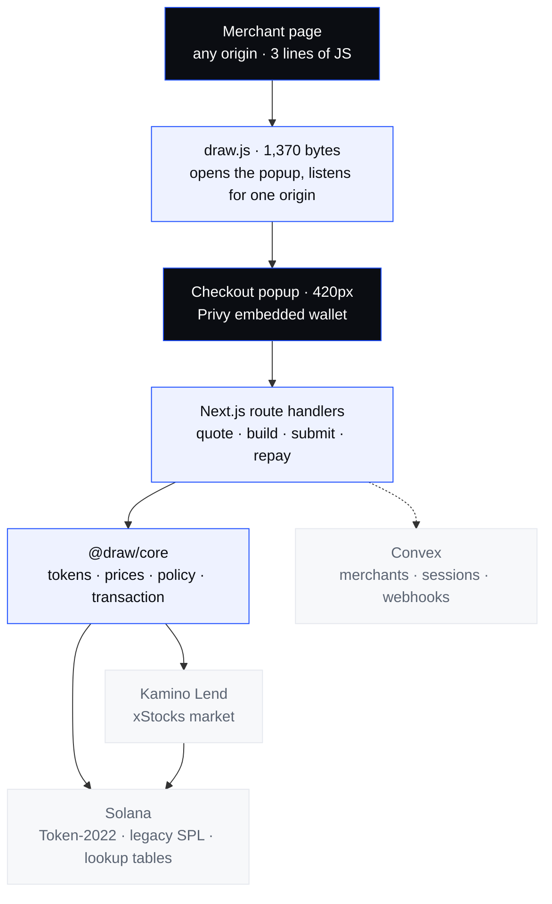

<a id="top"></a>

<h1 align="center">Draw</h1>

<p align="center">
  <strong>Pay without selling your shares.</strong><br>
  Portfolio-backed payments on Solana. One transaction, no credit check.
</p>

<p align="center">
  <a href="#ix-running-it"><strong>Run it locally</strong></a>
  &nbsp; · &nbsp;
  <a href="#x-what-is-true-and-what-is-not">What works today</a>
  &nbsp; · &nbsp;
  <a href="https://hackathons.solana.com/hackathons/stocklana">Stocklana ↗</a>
</p>

<p align="center">
  <sub>SOLANA &nbsp; / &nbsp; KAMINO LEND &nbsp; / &nbsp; TOKEN-2022 xSTOCKS &nbsp; / &nbsp; NEXT.JS 16</sub>
</p>

---

A draw is **17 instructions in one transaction**: deposit the collateral, refresh
the obligation, borrow the stablecoin, pay the merchant. It fits in
**1,036 of the 1,232 bytes** a Solana transaction is allowed.

Before the lookup table it was 1,512 bytes, and none of this existed.

| Instructions | Transaction size | Compute units | Signatures required |
| :---: | :---: | :---: | :---: |
| **17** | **1,036 / 1,232 bytes** | **317,774** | **2** — user, fee payer |

<p align="center"><sub>Recorded September 2026 · forked Solana mainnet via Surfpool · Kamino xStocks market.<br>Signature <code>3zDc3Pnc…9AFPq</code>. The full evidence table is in <a href="#x-what-is-true-and-what-is-not">What works today</a>.</sub></p>

> **The collateral is the underwriting.**
>
> Most of the world has no credit bureau, so it has no consumer credit. The
> bottleneck was never interest rates — it was the absence of underwriting data.
> A liquid, 24/7-liquidatable, on-chain asset replaces the bureau entirely.

| What has been observed on chain | Where the boundary is |
| :--- | :--- |
| Deposit, borrow and merchant payment landing atomically | Every measurement is against a mainnet **fork**, not mainnet. |
| A cross-origin merchant checkout paying a real merchant wallet | The merchant registry is one environment-configured store. |
| Repayment releasing the collateral, $40.00 → $0.00 | Partial repayment is built but unexercised. |
| A first-time user with zero SOL completing a payment | Draw sponsors the rent; that subsidy has no accounting behind it. |

**The webhook does not fire, and Convex has never been deployed.**
Both are stated plainly in [What works today](#x-what-is-true-and-what-is-not).

<details>
<summary><strong>Contents — the product, the engineering, the evidence</strong></summary>

| | Chapter | |
| :--- | :--- | :--- |
| 01 | [The gap](#i-the-problem) | Why you sell something you wanted to keep |
| 02 | [The promise](#ii-the-one-idea) | One confirmation, one transaction |
| 03 | [Architecture](#iii-the-shape) | Two origins, one chain layer |
| 04 | [The life of a draw](#iv-the-life-of-a-draw) | Quote, build, sign, submit |
| 05 | [The life of a repayment](#v-the-life-of-a-repayment) | Getting the shares back |
| 06 | [Risk](#vi-risk) | Draw's own limits, and why they are lower |
| 07 | [Engineering decisions](#vii-the-decisions) | Ten choices and the incidents behind them |
| 08 | [Repository map](#viii-the-map) | Where the moving parts live |
| 09 | [Run locally](#ix-running-it) | Fork, fund, run |
| 10 | [What works today](#x-what-is-true-and-what-is-not) | Observed, unobserved, absent |

</details>

---

<a id="i-the-problem"></a>

## 01 · The gap

You own $200 of Nvidia. You need $40 today.

Selling is the obvious move and it is the expensive one: a settlement delay, a
taxable event, and the permanent surrender of the upside on something you bought
because you believed in it. The alternative is not buying the thing.

The instrument that solves this already exists. It is called securities-backed
lending, and it is how wealthy people fund their lives without liquidating
anything. It requires a private bank, a six-figure minimum, days of paperwork,
and market hours.

**The asset became programmable before the credit product did.** xStocks are
Token-2022 mints with no freeze authority and no whitelist. Kamino will already
lend against them. Nothing between those two facts and a checkout button existed,
which is the entire reason this repository does.

---

<a id="ii-the-one-idea"></a>

## 02 · The promise

> **One confirmation. One transaction. You keep the shares.**

A merchant site has a *Pay with Draw* button. The user clicks it, sees
*"borrowing $40 against your NVDAx — you keep all 1.42 shares"*, and confirms.

Behind that single confirmation, one Solana transaction deposits the collateral,
borrows the stablecoin, and pays the merchant. Everything else in this repository
is downstream of that sentence:

- **Atomic or nothing.** There is no window where a user has taken on debt and
  the merchant has not been paid. That is not a retry policy, it is the
  transaction boundary.
- **The merchant never learns what the funding source was.** The SDK's surface
  mentions no wallet, no collateral, no liquidation. If integrating required
  understanding any of it, the argument for Draw collapses.
- **Nothing the client sends is trusted with money.** The payee comes from the
  origin. The quote is recomputed server-side. Both are
  [decision 6](#6-the-client-never-names-the-payee-and-never-names-the-price).

---

<a id="iii-the-shape"></a>

## 03 · Architecture

Two origins, because a payment surface that trusts its host page is not a payment
surface. One chain layer, because every byte that reaches Solana should be built
by the same code.

| Surface | Location | Stack | Role |
| :--- | :--- | :--- | :--- |
| **App** | [`apps/web/`](apps/web/) | Next.js 16 · Tailwind 4 | Landing, portfolio, checkout popup, API routes |
| **Demo merchant** | [`apps/store/`](apps/store/) | Next.js 16 | A different origin, on purpose |
| **Chain layer** | [`packages/core/`](packages/core/) | `@solana/kit` · klend-sdk v12 | Tokens, pricing, Kamino, policy, transactions |
| **Integration** | [`packages/sdk/`](packages/sdk/) · [`embed/`](packages/embed/) | zero-dependency TS | Sessions, webhook verification, a 1,370-byte shim |



**On-chain is value and ownership; off-chain is coordination.** Balances, debt,
collateral and the payment itself live on Solana. Convex holds merchants and
checkout sessions — the things a public ledger is the wrong place for. There is
no payments table anywhere: the transaction signature *is* the receipt, and a
second record of it could only ever disagree with the first.

> [!IMPORTANT]
> The dotted line to Convex is dotted for a reason. Its functions are written and
> its schema is defined; `convex dev` has never been run against this repository.
> The checkout path in use reads its amount and origin from the popup URL and
> never calls `/api/sessions`. See [What works today](#x-what-is-true-and-what-is-not).

---

<a id="iv-the-life-of-a-draw"></a>

## 04 · The life of a draw

Four server round trips, one browser signature, one transaction.

| Stage | Where | What it establishes |
| :--- | :--- | :--- |
| **01 · Open** | `draw.js` in the merchant page | A 420px popup on Draw's origin, not an iframe in theirs |
| **02 · Quote** | `POST /api/quote` | Collateral required, health factor, liquidation price, 30s TTL |
| **03 · Build** | `POST /api/tx/build` | The unsigned transaction, fee payer declared, quote recomputed |
| **04 · Sign** | The browser | Privy embedded wallet. Draw holds no user key material |
| **05 · Submit** | `POST /api/tx/submit` | Fee payer co-signs, **simulates**, then sends |

<details>
<summary><strong>1 · Pricing — the reserve's own oracle, never a second feed</strong></summary>

`packages/core/src/prices.ts` reads collateral value from the Kamino reserve
Draw will actually borrow against. Not Pyth directly, not a price API.

Pricing collateral from one source while the protocol liquidates against another
tells users they are safe right up until they are not. The two numbers agree
because they are the same number.

The liquidation threshold is read from `reserve.state.config` on every quote for
the same reason — it differs per asset and changes when Kamino reconfigures a
market, and a hardcoded copy would put Draw's health factor quietly out of step
with the protocol's.

</details>

<details>
<summary><strong>2 · The transaction — what actually goes in it</strong></summary>

```text
   ┌─ setup ──────────────── first draw only, rides along in the same tx
   │  initUserMetadata · InitObligation · createUserLut
   │  ATA creation for collateral and debt
   │  ~0.05 SOL from the fee payer, because Kamino bills the USER for this
   │
   ├─ lending ─────────────── every draw
   │  RefreshReserve · RefreshObligation
   │  Deposit          ← collateral in
   │  inBetweenIxs     ← the refresh that makes the deposit visible
   │  Borrow           ← stablecoin out
   │
   └─ payment ────────────── the part the merchant cares about
      Transfer  user → merchant
```

The ordering of `inBetweenIxs` is not cosmetic. Kamino returns it as a separate
array precisely because it belongs *between* the deposit and the borrow; placed
before both, the obligation refresh sees an empty obligation and the whole thing
fails with `InvalidAccountInput`, an error that names nothing relevant.
`interleaveLendingIxs` in [`kamino.ts`](packages/core/src/kamino.ts) exists
entirely for that.

Deposit-and-borrow is built as one `KaminoAction` rather than a deposit followed
by a borrow, which matters: both legs land on the same obligation by
construction, so there is no way to deposit into one position and borrow against
another.

</details>

<details>
<summary><strong>3 · Fitting inside 1,232 bytes</strong></summary>

The assembled draw was **1,512 bytes**. The limit is 1,232. There is no version
of this product that does not solve that.

The fix is a Draw-owned address lookup table holding **22 accounts** — the
intersection of the accounts two different users' draws touch, so it compresses
any user's transaction rather than one user's. Kamino also mints a per-user
table during setup, and `getUserLookupTable` reads it back out of the user's
`UserMetadata` PDA.

```text
   1,512 bytes   no lookup table          over the limit, nothing can pay
   1,036 bytes   shared LUT, 22 accounts  196 bytes of headroom
```

`serverEnv.lookupTables` reads the table address **from disk on every request**
rather than from the environment. A fork reset mints a new table, environment
variables are fixed when the server boots, and needing a restart after every
reset is exactly the kind of thing that fails during a demo.

</details>

<details>
<summary><strong>4 · Simulate, then send</strong></summary>

`/api/tx/submit` co-signs, simulates with `sigVerify: false`, and only sends on a
clean simulation. A transaction that is going to fail should fail where there is
still a person to explain it to, rather than on chain where the user has
committed and gets back a signature that went nowhere.

The failure copy says *"That payment can't go through right now. Nothing was
charged."* The second sentence is the one that matters and it is true by
construction — an unsent transaction moved nothing.

</details>

---

<a id="v-the-life-of-a-repayment"></a>

## 05 · The life of a repayment

Borrowing against shares you cannot get back is not credit. It is a sale with
extra steps.

`POST /api/repay` reads the obligation from chain, builds a repayment for the
full outstanding amount, and the same wallet signs it. The collateral is released
by the protocol, not by Draw.

One detail worth its own line: `getObligationSummary` rounds the owed amount
**up** to the nearest base unit. Repaying a hair less than owed leaves dust debt
behind, the position stays open, and the user is left somewhere confusing — told
they repaid, still holding a loan.

```text
   owed before   $40.00
   landed: gkzJiTzExz844VBJcqZMxJnyKREkcPiLqn5DdpC3yfCBez6sKfvHEczhGgKodnKNP6yoTxYR43i43hXVnTnSMmB
   owed after    $0.00
```

---

<a id="vi-risk"></a>

## 06 · Risk

[`policy.ts`](packages/core/src/policy.ts) is 165 lines and 22 unit tests, and it
is the only file in the repository allowed to decide whether a draw may happen.

| Rule | Value | Why |
| :--- | :---: | :--- |
| `maxLtv` | **0.35** | Kamino may permit 65%. Draw exposes roughly half. |
| `warnHealthFactor` | 1.6 | The UI turns amber here. |
| `dangerHealthFactor` | 1.25 | New draws are refused here. |
| `minDrawUsd` | 1 | Below this the network cost stops making sense. |
| `quoteTtlSeconds` | 30 | A quote stays signable this long, then it is re-priced. |

**The gap between 35% and 65% is the user's margin, and it exists because of
something specific to this asset class.** Tokenized equities trade 24 hours a
day; the underlying market does not. A position opened on Saturday can gap hard
at Monday's open with no chance for anyone to react. That is a product decision,
not a technical constraint, and it is written down as one.

**No leverage loops.** Borrowed funds cannot be redeposited. This is a spending
product, not a leverage product, and the two have different blast radii.

**The number shown to the user is the liquidation price.** "Health factor 1.42"
means nothing to someone who wants to buy a chair. "Your position is at risk if
NVDA drops below $82.40" is immediately legible, and
`priceDropToLiquidationPercent` turns it into the distance that actually matters.

Every one of these checks runs server-side in `checkDrawAllowed` before anything
is built. The client's idea of what is affordable is a suggestion.

---

<a id="vii-the-decisions"></a>

## 07 · Engineering decisions

Each of these is a fork the project actually stood at. The dated lines are
incidents this repository can point to.

<a id="1-never-hardcode-a-token-program"></a>

<details>
<summary><strong>1. Never hardcode a token program — resolve it from the mint, every time</strong></summary>

xStocks are Token-2022. USDC is the original SPL token program. Draw touches both
in the same transaction.

Deriving an associated token address with the wrong program id does not throw. It
produces a valid-looking address that simply does not exist, and every error
downstream points nowhere near the mistake.

So nothing in this codebase names a token program. `getTokenProgram` reads the
mint account's owner and caches it — mints do not migrate — and `getAta`,
`createAtaInstruction` and `getTokenBalance` all route through it.

> The same trap on the funding side: Surfpool's `surfnet_setTokenAccount` takes
> the token program as a **fourth** parameter. Omit it and it writes an xStock
> balance into a legacy SPL account that Kamino then cannot see.

</details>

<a id="2-the-instruction-that-passes-through-a-program-is-not-the-instruction-that-runs-on-it"></a>

<details>
<summary><strong>2. A program an instruction passes through is not the program it runs on</strong></summary>

`createAtaInstruction` originally passed `{ programAddress: tokenProgram }` as a
config override, which reads as *"use this token program"* and in fact means
*"run this entire instruction on the token program"*. It failed with
`InvalidArgument` and nothing in the message suggested why.

`tokenProgram` is an **account** the ATA instruction passes through to. It goes
in the accounts, not the config. The comment explaining that is still in
[`tokens.ts`](packages/core/src/tokens.ts) because the mistake was not obvious the
first time and will not be the second.

</details>

<a id="3-kamino-bills-the-user-for-their-own-account-setup"></a>

<details>
<summary><strong>3. Kamino bills the user for their own account setup — so Draw pays it</strong></summary>

A first-time draw creates user metadata, an obligation and a per-user lookup
table. Kamino charges the rent for all three to the **user**, not to the fee
payer, which for a product whose whole pitch is *"a wallet that has never held
SOL can pay for something"* is fatal:

> `Transfer: insufficient lamports 0, need 1280640`

`buildDrawTransaction` prepends a `transferSol` of `SETUP_RENT_LAMPORTS` from the
fee payer to the user, and the setup rides along in the same transaction as the
payment. It fits once the lookup table is applied, and keeping it to one
transaction is the entire point: the user sees a payment, not a setup step
followed by a payment.

The subsidy is real money with no accounting behind it. That is named as open
work rather than hidden.

</details>

<a id="4-a-mint-can-back-more-than-one-reserve"></a>

<details>
<summary><strong>4. `getReservesByMint` returns an array, and the first element is a decision</strong></summary>

Kamino runs float-rate and fixed-rate reserves against the same mint. There is no
`getReserveByMint`, and there should not be — the SDK is right to make the caller
choose.

Draw takes `[0]`, the float reserve, because that is what Kamino's own lending UI
treats as the default market. One line, one comment, in `findReserveByMint`.

> The larger version of this: xStocks are **not in Kamino's main market**. A probe
> of the main market returned 41 reserves and zero tokenized stocks. Draw points
> at the dedicated xStocks market, `5wJeMrUY…ULsua`, and the fact that this cost
> an afternoon to discover is the reason `pnpm probe` exists as a first-class
> script rather than a scratch file.

</details>

<a id="5-the-fork-is-a-tool-not-a-mock"></a>

<details>
<summary><strong>5. The fork is a tool, not a mock — and it must be kept alive carefully</strong></summary>

Surfpool clones mainnet state: real Kamino reserves, real xStocks mints, real
oracle accounts. It let this project test multi-thousand-dollar positions and
liquidation edges with no capital, on a four-day clock, which is not something
anyone can responsibly do with real money.

It also ages. A fork clones an oracle once and then its own clock keeps moving,
so after roughly half an hour every borrow is rejected with `ReserveStale` and a
price status of `00110101`.

The fix is `surfnet_streamAccount` on **oracle price accounts only**, derived
from each reserve's `pythConfiguration.price` and `scopeConfiguration.priceFeed`.

Two things learned the hard way, both now encoded in
[`oracles.ts`](packages/scripts/src/oracles.ts) and
[`refresh.ts`](packages/scripts/src/refresh.ts):

> **Re-pulling a reserve erases the fork.** The first version of `pnpm refresh`
> called `resetAccount` on reserves and vaults. That re-fetches mainnet state on
> top of local state and deletes every deposit made on the fork. It looks exactly
> like data loss because it is.
>
> **Streaming a sysvar kills surfpool outright** —
> `Failed to set account SysvarRent111...: Invalid Rent sysvar data`. Hence the
> filter to price accounts, and the explicit `SYSTEM_PROGRAM` skip.

</details>

<a id="6-the-client-never-names-the-payee-and-never-names-the-price"></a>

<details>
<summary><strong>6. The client never names the payee, and never names the price</strong></summary>

Two separate rules, both enforced in `/api/tx/build`, both load-bearing.

**The payee is resolved from the origin.** `resolveMerchant(origin)` maps the
origin the checkout was opened from to a registered wallet. It is never read from
a request parameter, because a client-supplied payee means anyone can open Draw's
checkout pointed at their own wallet and have someone else's collateral pay them.

**The quote is recomputed server-side at build time.** The request carries an
amount and an owner. It does not carry collateral or borrow amounts, and if it
did they would be ignored — a client that can hand us its own numbers can hand us
favourable ones.

An unregistered origin is refused with 403 outright. An unreachable registry
resolves to nobody, which is the safe failure: nothing can be paid rather than
anything can.

</details>

<a id="7-the-signature-is-the-receipt"></a>

<details>
<summary><strong>7. The signature is the receipt — there is no payments table</strong></summary>

Convex holds merchants and sessions. It does not hold payments, and adding a
payments table would create a record that can only ever disagree with the chain.

The consequence is that the merchant's source of truth must be the **webhook**,
not the popup's `postMessage`. `@draw/sdk` says so in as many words, and
`verifyWebhook` rejects anything older than 300 seconds and compares MACs in
constant time — a plain `===` returns on the first differing character, and that
timing is enough to recover a signature one character at a time.

> **This rule is currently violated by this repository's own demo store.**
> `/api/tx/submit` dispatches no webhook, so the store treats a browser
> `postMessage` as proof of payment — precisely what the SDK documentation tells
> merchants never to do. It is listed in
> [open work](#x-what-is-true-and-what-is-not) rather than quietly left in place.

</details>

<a id="8-privy-holds-the-key-draw-never-does"></a>

<details>
<summary><strong>8. Privy holds the key. Draw holds the fee payer, and only that.</strong></summary>

The user signs in the browser with a Privy embedded wallet — email login, no seed
phrase, no extension, no prior SOL. Draw never sees user key material.

Draw's own key is the fee payer, and `lib/feePayer.ts` is marked `server-only` so
importing it into a client component fails at build rather than at the worst
possible moment. The same marker is on `lib/merchants.ts` and `lib/convex.ts`.

> Privy's Solana wallet creation is **not** the documented top-level
> `createOnLogin` — that path is Ethereum-only and deprecated. It is
> `embeddedWallets.solana.createOnLogin: "all-users"`, with an explicit
> `createWallet()` backstop for accounts that predate the setting.

</details>

<a id="9-the-landing-page-loads-no-privy"></a>

<details>
<summary><strong>9. The landing page ships zero client JavaScript from the wallet SDK</strong></summary>

`PrivyProvider` originally wrapped the root layout, so every page — including a
static marketing page that never touches a wallet — booted an authentication SDK
and its iframe before rendering.

> 2026-09-15 — the deployed site hung on load. Not slow: hung, on a page whose
> entire content is server-rendered HTML.

The provider now lives in `app/portfolio/layout.tsx` and `app/checkout/layout.tsx`
only. The landing page is a server component with no provider above it and
cannot hang on an SDK it does not use.

</details>

<a id="10-a-gitignore-line-can-delete-a-feature"></a>

<details>
<summary><strong>10. An unanchored `.gitignore` pattern can silently delete a feature</strong></summary>

`.gitignore` contained `build/`. Unanchored, that matches **any** directory named
`build` at any depth — including `apps/web/app/api/tx/build/`, the route handler
that assembles the entire transaction.

It was never committed. Everything typechecked, every test passed, and the repo
did not contain the core of the product. Found only by reading `git ls-files`
output line by line while chasing something else.

The pattern is now anchored. The general lesson is narrower than "be careful with
gitignore": **a passing local build proves nothing about what is in the
repository**, and those are two different questions that deserve two different
checks.

</details>

---

<a id="viii-the-map"></a>

## 08 · Repository map

6,851 lines of TypeScript across seven workspace packages.

| Package | Lines | Responsibility |
| :--- | ---: | :--- |
| [`packages/core/`](packages/core/) | 1,766 | Tokens, prices, Kamino, policy, transaction assembly |
| [`apps/web/`](apps/web/) | 3,150 | Landing, portfolio, checkout, API routes, Convex functions |
| [`packages/scripts/`](packages/scripts/) | 1,258 | Fork lifecycle, funding, probes, end-to-end runs |
| [`packages/shared/`](packages/shared/) | 227 | Domain types and money handling |
| [`packages/sdk/`](packages/sdk/) | 207 | Merchant SDK — sessions, quotes, webhook verification |
| [`packages/embed/`](packages/embed/) | 133 | The 1,370-byte script that opens checkout |
| [`apps/store/`](apps/store/) | 110 | Demo merchant, on a separate origin on purpose |

<details>
<summary><strong>Open the full source map</strong></summary>

```text
   packages/core/src/          everything that touches the chain
     tokens.ts                 Token-2022 vs legacy SPL — resolve, never assume
     prices.ts                 collateral value from the reserve's own oracle
     kamino.ts                 market load, draw / repay instructions, obligation
     policy.ts                 Draw's risk rules — 22 tests, the only gate
     quote.ts                  price a draw without committing to it
     transaction.ts            assembly, lookup tables, rent sponsorship
     connection.ts             the RPC client
     constants.ts              program ids, market and mint addresses

   apps/web/
     app/page.tsx              landing — server component, no client JS
     app/portfolio/            holdings, debt, repayment
     app/checkout/             the 420px popup
     app/api/quote/            price a draw
     app/api/tx/build/         assemble the unsigned transaction
     app/api/tx/submit/        co-sign, simulate, send
     app/api/repay/            release the collateral
     app/api/sessions/         merchant-declared checkout sessions (Convex)
     convex/                   merchants · sessions · webhooks · schema
     lib/feePayer.ts           server-only. the one key Draw holds
     lib/merchants.ts          server-only. origin → payee
     components/               Hero, HoldingsField, InkTrail

   packages/scripts/src/       the fork, as a set of commands
     start-surfnet.sh          hold the fork in its own terminal
     reset.ts                  fresh fork: fund, set up, mint the lookup table
     refresh.ts                stream oracle prices — and nothing else
     oracles.ts                which accounts are safe to stream
     probe.ts                  which reserves Kamino will actually lend against
     fund.ts                   mint collateral and stablecoin into a wallet
     e2e-draw.ts               a full draw, no browser
     e2e-repay.ts              the other half
     portfolio.ts              exercise the whole read path from a terminal
```

</details>

---

<a id="ix-running-it"></a>

## 09 · Run locally

Node 20+, pnpm, [Surfpool](https://github.com/solana-foundation/surfpool), and a
free [Helius](https://helius.dev) key. **No real money is required at any point.**

### 1 · Fork mainnet

Hold it in its own terminal. Surfpool is torn down when nothing keeps its session
alive, and a detached fork will die under you mid-demo.

```bash
pnpm install
pnpm chain          # surfpool start --url <helius mainnet>
```

### 2 · Find the collateral mint

```bash
pnpm probe          # prints every reserve the xStocks market will lend against
```

Set `NEXT_PUBLIC_XSTOCK_MINT` from the output. This is not boilerplate — Kamino's
main market carries 41 reserves and none of them are stocks.

### 3 · Configure

`.env.local` at the repository root. Both apps and every script read this one
file; Next does not find it on its own, so `next.config.ts` loads it explicitly.

```dotenv
HELIUS_API_KEY=
NEXT_PUBLIC_RPC_URL=http://127.0.0.1:8899
NEXT_PUBLIC_PRIVY_APP_ID=
NEXT_PUBLIC_XSTOCK_MINT=            # from pnpm probe
FEE_PAYER_SECRET_KEY=               # pnpm keygen
DEMO_MERCHANT_ORIGIN=http://localhost:3001
DEMO_MERCHANT_WALLET=
DEMO_MERCHANT_NAME=Kitui Supply Co.
```

`NEXT_PUBLIC_*` values are inlined into the browser bundle by design. None of
them is a secret, which is exactly why nothing private may ever carry that
prefix. `FEE_PAYER_SECRET_KEY` is read only through `lib/feePayer.ts`, which is
marked `server-only`.

### 4 · Fund and run

```bash
pnpm reset <your-wallet>            # fund, set up Kamino, mint the lookup table
pnpm dev                            # app       localhost:3000
pnpm shop                           # merchant  localhost:3001
```

Then open the store, add something to the basket, and pay.

> [!TIP]
> If borrows start failing with `ReserveStale`, the fork's oracles have aged out.
> `pnpm refresh` streams them from mainnet without touching reserve state. It does
> **not** need a restart and it will **not** erase your deposits — which is more
> than could be said for its first version.

### 5 · Verify

```bash
pnpm typecheck      # all 8 packages
pnpm test           # 22 policy tests
pnpm build

pnpm portfolio <wallet> [amount]    # the whole read path, no browser
pnpm --filter @draw/scripts exec tsx src/e2e-draw.ts <secret>
pnpm --filter @draw/scripts exec tsx src/e2e-repay.ts <secret>
```

`pnpm portfolio` exercises the Token-2022 resolver, the Kamino market load,
oracle pricing and the risk policy in one command. If it prints sensible numbers,
the only thing left unproven is signing.

<details>
<summary><strong>Pointing at real mainnet</strong></summary>

Change `NEXT_PUBLIC_RPC_URL`. That is the whole change — no code path branches on
whether it is talking to a fork.

What it would then need that it does not have: a funded fee payer, a real
merchant registry rather than one environment-configured store, and the webhook
actually firing. The first is money; the other two are listed below as open work.

</details>

---

<a id="x-what-is-true-and-what-is-not"></a>

## 10 · What works today

This is the repository's recorded verification status. Everything below was run
against a **forked** Solana mainnet, which is stated here rather than implied
anywhere else.

<details open>
<summary><strong>Observed on chain</strong></summary>

| What | Evidence |
| :--- | :--- |
| Full draw — deposit, borrow, pay, atomically | `3zDc3PncwSsBx5iQFSbLDFRfmkQ8yo5wRc5cvpK3arqmiXfF6v2SoXHcYU2FuSv2FVq8rv5s9SY2sNa5zgw9AFPq`<br>17 instructions · 1,036 / 1,232 bytes · 317,774 CU |
| Payment from a browser, from a different origin | `4hyK1fo6Qtv8T8gtRXxfoq61wSTWPAzBDQV7jmsDrqqPj3wBQ578y2b4s9zLmYk7NqoogndvG9kDEfLRSECXv9zo` |
| The merchant actually receiving the money | `w4sLs5BhvttUXdooSUH14xdXVe2aCoCKGu3Eeud2Yu662guNQtML2kXZfNMnTkbtq3HKJ9N4pRXDSBKPXAio3uU`<br>merchant balance reached 80.007522 USDC across two payments |
| Repayment releasing the collateral | `gkzJiTzExz844VBJcqZMxJnyKREkcPiLqn5DdpC3yfCBez6sKfvHEczhGgKodnKNP6yoTxYR43i43hXVnTnSMmB`<br>owed $40.00 → $0.00 |

Also observed: a wallet holding **zero SOL** completing a first-ever payment with
account setup in the same transaction; email login through Privy with no seed
phrase and no extension; the risk policy refusing draws above the 35% cap; and
simulation catching a failing transaction before the user was asked to sign.

</details>

<details>
<summary><strong>Built, not observed end to end</strong></summary>

- **The webhook does not fire.** `/api/tx/submit` returns a signature to the
  browser and tells no one else. `convex/webhooks.ts` is written, `verifyWebhook`
  in the SDK is written and correct, and nothing dispatches between them. The
  demo store therefore trusts a browser `postMessage` — which
  [decision 7](#7-the-signature-is-the-receipt) says explicitly that no merchant
  should ever do. This is the single largest gap in the repository.
- **Convex has never been deployed.** `convex dev` has not been run,
  `convex/_generated/` does not exist, and `lib/convex.ts` hand-writes its
  function references for exactly that reason. The merchant registry that the
  checkout actually uses is `DEMO_MERCHANT_*` in the environment. The
  Convex-backed session path — `POST /api/sessions`, `sessions.create`,
  `recordQuote`, `setStatus` — is written and unexercised; the checkout in use
  reads its amount and origin from the popup URL.
- **Partial repayment.** `buildRepayInstructions` takes an amount and the route
  passes the full outstanding balance. Repaying less has never been run.
- **Mainnet.** Every signature above is from a fork. Nothing in the code branches
  on which it is talking to, and that is a claim about the code rather than an
  observation about mainnet.

</details>

<details>
<summary><strong>Deliberately absent</strong></summary>

- **No Draw program.** Draw composes Kamino's instructions from the client rather
  than CPI-ing into it from an on-chain program. A program would give guaranteed
  atomicity independent of transaction size, protocol-level fee capture, and a
  position abstraction others could build on. Everything done here in seventeen
  instructions, one program would do in one. That is the next thing to build, not
  a thing that was skipped.
- **No leverage.** Borrowed funds cannot be redeposited, by construction.
- **No payments table.** [Decision 7](#7-the-signature-is-the-receipt).
- **No mobile app.** Web only, on purpose, for this deadline.

</details>

<details>
<summary><strong>Open engineering work</strong></summary>

- The setup-rent subsidy is real money leaving the fee payer with no accounting
  behind it and no cap per user.
- The merchant registry is one environment-configured origin. Onboarding a second
  merchant currently means an environment variable.
- `quoteTtlSeconds` is 30 and nothing enforces it at build time — the quote is
  recomputed rather than validated, which is safe but means an expired quote is
  silently re-priced instead of being rejected.
- The name **Draw** has not been checked for collisions with existing Solana
  projects.
- No `LICENSE` file has been committed yet; the intent is MIT.

</details>

---

<p align="center">
  <br>
  <strong>Draw</strong><br>
  <sub>Get the value. Don't give up the gains.</sub><br><br>
  <a href="https://hackathons.solana.com/hackathons/stocklana">Built for Stocklana ↗</a>
  &nbsp; · &nbsp;
  <a href="#top">Back to top ↑</a>
</p>
